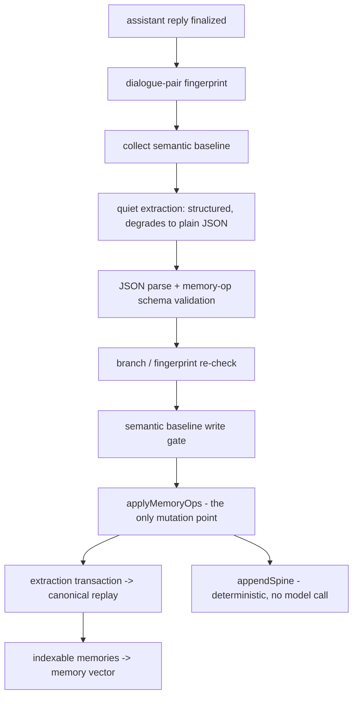
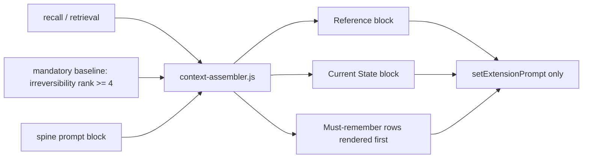

# Architecture

<!-- Versioned & append-only: never edit past versions; newest is last. -->

<!-- VERSION 1 -->
## v1 - baseline (pre-versioning)

> System architecture, module boundaries, key flows, diagrams.

<!-- VERSION 2 -->
## v2 - 2026-09-11 00:22:36 - describe the v5.5 architecture and module boundaries

### 1. Four kinds of data

The design keeps four things apart that summaries usually merge:

    A. Canonical Baseline       Persona / Character / World Info       "what it always was"
    B. Extraction Transactions  one per completed user+assistant pair  "what this turn changed"
    C. Canonical Memory Store   replay(transactions)                   "what the story changed"
    D. Derived Indices          vector / summaries / spine / audits    "how to find it again"

Canonical never depends on Derived. Losing the derived record costs a rebuild, never a fact.

One nuance introduced in iteration 13: the **memory spine** is logically authoritative (it is appended
from the same operations that mutate the store, never by a language model, so a replay rebuilds it
byte-identically) but it is *stored* in the derived record, because it is rebuildable and the chat
file should not carry it.

### 2. Entry chain

    manifest.json
      -> index-v55-bootstrap.js     installs the ownership guard first, then the staged core
           -> v55-store-integrity.js
           -> index-v55.js (init)
                -> index.js          the v5.4-lineage runtime: extraction, replay, retrieval, injection
           -> v55-derived-store.js, v55-summary-runtime.js, v55-floor-fold.js, UI modules

The bootstrap exists because ordering is load-bearing: the store ownership guard must be installed
before the core runs, or canonical replay assignments erase independently-owned runtime state.

### 3. Module map

| Group | Files | Responsibility |
| --- | --- | --- |
| Entry | `manifest.json`, `index-v55-bootstrap.js`, `index-v55.js`, `index.js` | load order, settings UI, generation interceptor |
| Core memory | `memory-core.js`, `memory-extractor.js`, `memory-op.schema.json` | extraction contract, `applyMemoryOps` (the only place memories mutate), replay |
| Injection | `context-assembler.js` | budget, labelling, reference/current-state/mandatory blocks |
| v5.5 runtime | `v55-runtime.js`, `v55-finalizer.js`, `v55-summary-runtime.js`, `v55-floor-fold.js` | finalisation, hierarchical summaries, floor folding |
| v5.5 state | `v55-derived-store.js`, `v55-store-integrity.js`, `v55-spine.js`, `v55-consistency.js` | derived ownership, replay guard, deterministic spine, self-check |
| v5.5 support | `v55-tokenizer.js`, `v55-evidence.js`, `v55-provenance.js`, `v55-privacy.js`, `v55-metrics.js`, `v55-selfcheck.js`, `v55-rerank.js` | accounting, evidence expansion, provenance, privacy, metrics |
| Vectors | `v55-vector-policy.js`, `v55-private-vector-transport.js`, `v55-tauri-native-http-bridge.js`, `v55-tauri-vector-backend.js` | per-chat vector space identity, transport isolation, host-native HTTP |
| Settings | `setting-schema.js`, `setting-store.js`, `setting-importer.js`, `setting-index.js`, `setting-retriever.js`, `source-adapters/` | plugin-owned world info plane |
| Baseline | `baseline-host.js`, `baseline-index.js`, `embedding-profile.js`, `retrieval-eval.js` | semantic baseline collection, indexing, profile identity |
| UI | `settings.html`, `style.css`, `v55-ui-polish.js`, `v55-embedding-profile-ui.js`, `v55-api-connections.js` | panel and connection settings |

### 4. Write pipeline

### 5. Injection path

Injection never appends pseudo-messages to the chat array; it goes through the host prompt extension
API, so the visible transcript and the model context stay independent.

### 6. Failure isolation

- A failed extraction is recorded as a diagnostic and never stored as a memory or a summary.
- The extraction provider degrades once: if the host rejects `response_format`/`json_schema`, the
  remaining attempts for that session use plain JSON instead of retrying a doomed request.
- An unreachable derived backend leaves the derived keys in the chat file, which is the previous
  behaviour - it never silently writes an empty store over a real one.
