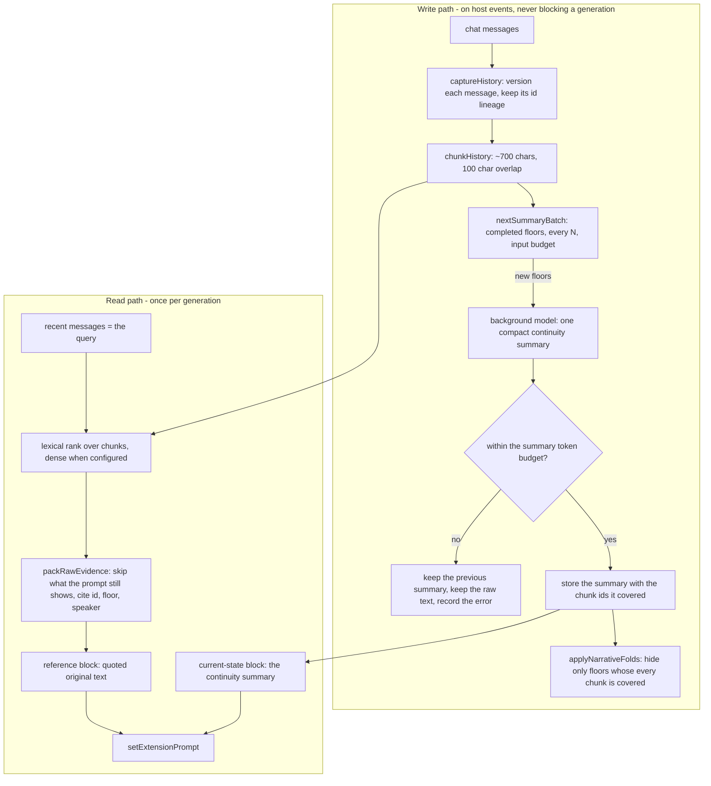

# Architecture

**Scope of this document.** The whole system on one page, for a reader who does not know the module
names. Superseded designs and their measurements are in Git history; the decision that
replaced them is [decisions/ADR-0001](decisions/ADR-0001-narrative-memory-architecture.md).

### 1. The shape of it

Two products come out of the original text, and they are produced for different jobs:

| Product | Job | Budget | Rebuilt from |
| --- | --- | --- | --- |
| Narrative summary | Let the story continue: where we are, why, who wants what, what is unresolved | narrative_summary_tokens (default 600) | the original text, every N floors |
| Original-text evidence | Answer a question that needs the exact wording, number or negation | narrative_evidence_tokens (default 1000) | indexed original-text chunks, per generation |

The original text is never thrown away to save space. It is chunked, indexed and quoted.

### 2. Life of one generation

1. The host calls the single interceptor (aetheriaUnifiedMemoryV54Interceptor).
2. If the host is generating a quiet prompt, an impersonation, or the plugin's own background
   summary, both prompt channels are cleared and the call returns.
3. Otherwise the plugin captures the chat into the versioned archive, folds what the accepted
   summary covers, and builds:
   - the current-state block: the continuity summary, or nothing when there is none;
   - the reference block: original-text evidence, plus relevant setting entries.
4. The two blocks are registered with setExtensionPrompt at fixed depths, and the transcript's
   collapsed styling is re-applied.
5. After the generation, the host's events schedule the background pass: at most one summary job per
   chat store at a time, and only the newest unsummarized completed floors.

### 3. Where the decision to show or hide text lives

| Question | Answer | Module |
| --- | --- | --- |
| Which text is covered by the summary? | The exact chunk-id prefix the summary reported | raw-history.js, validSummary |
| May this floor leave the prompt? | Only if every chunk of it is covered, and it is not the newest floor | raw-history.js, applyNarrativeFolds |
| What if the summary cannot be injected? | Every floor it covered comes back, and the reason is recorded | narrative-runtime.js, buildNarrativeContext |
| What if the history changed under the summary? | The summary is dropped, the invalidation is reported, and the floors come back | narrative-runtime.js, prepare |
| Who writes the transcript styling? | Only the projection of the markers; it never writes chat state | v55-floor-fold.js |

### 4. Modules

Live path, reachable from index-v55-bootstrap.js:

| Job | Files |
| --- | --- |
| Host bootstrap and settings shell | index-v55-bootstrap.js, index-v55.js, settings.html, style.css, v55-ui-polish.js, v55-api-connections.js, v55-embedding-profile-ui.js |
| Original text: archive, chunks, folds, evidence | raw-history.js, v55-floor-fold.js |
| The pipeline: summary job, index sync, budgeted assembly | narrative-runtime.js |
| The quiet summary request (cloned preset, response metrics) | summary-transport.js |
| Host adapters (store, identity, vectors, setting retrieval, metrics) | index.js |
| Chat store, replay, operations, tokenizer | memory-core.js, v55-store-integrity.js, v55-store-compact.js, v55-derived-store.js, v55-tokenizer.js |
| Vector transport and space identity | v55-vector-policy.js, v55-private-vector-transport.js, v55-tauri-vector-backend.js, v55-tauri-native-http-bridge.js, v55-rerank.js |
| Setting plane | setting-schema.js, setting-store.js, setting-importer.js, setting-index.js, setting-retriever.js, source-adapters/ |
| Baseline plane | baseline-index.js (the tokenizer and lexical floor the ranking uses) |
| Measurement | v55-metrics.js |

Retired (ADR-0007, ADR-0009): the v5.4 extraction pipeline, the prompt assembler, the recall path,
the cold-snapshot cache, the length certificate, the quality metrics, the reranker, the retrieval
self-check and the baseline builder - with the tests that pinned them. index.js keeps the host
adapters, the chat store, the setting plane and the migration of old chats.

The fact set itself no longer lives in the chat file either: memories, slots and hierarchical_summaries
are derived keys, written to the external record and rebuildable from the canonical replay log, which
the chat file keeps (ADR-0004).

### 5. Invariants

| Id | Statement | Enforced by |
| --- | --- | --- |
| N1 | A floor is hidden only while an accepted summary covers every chunk of it | applyNarrativeFolds |
| N2 | The newest assistant floor, and the user turn that produced it, are never hidden | applyNarrativeFolds |
| N3 | A summary is injected only while it still matches the current chunk list | validSummary, prepare |
| N4 | If the summary cannot be injected, its floors are restored in the same call | buildNarrativeContext |
| N5 | Background work is written only into the chat that started it | services.isCurrent |
| N6 | Superseded message versions are archived, never overwritten | captureHistory |
| N7 | Evidence quoting skips text the prompt still carries | packRawEvidence |

### 6. What this architecture does not do yet

- Dense retrieval over original text needs a configured embedding backend; without one the pipeline
  is lexical-only and says so in its diagnostics.
- The archive keeps every superseded version, and nothing prunes it. Measured at about one copy of the
  conversation text (41-351 KB per chat, 4-33% of the file), which is why it stays lossless (ADR-0004).
  Growth on very long chats is still unmeasured.
- Knowledge boundaries are text, not enforcement: a character cannot be prevented from acting on a
  fact that appears in the summary.
- v55-spine.js survives because the live memory-core.js uses it for the fact model spine bookkeeping,
  and applyMemoryOps is the migration path for old chats. Retiring it is a data decision, not a
  dead-code one (ADR-0009).
