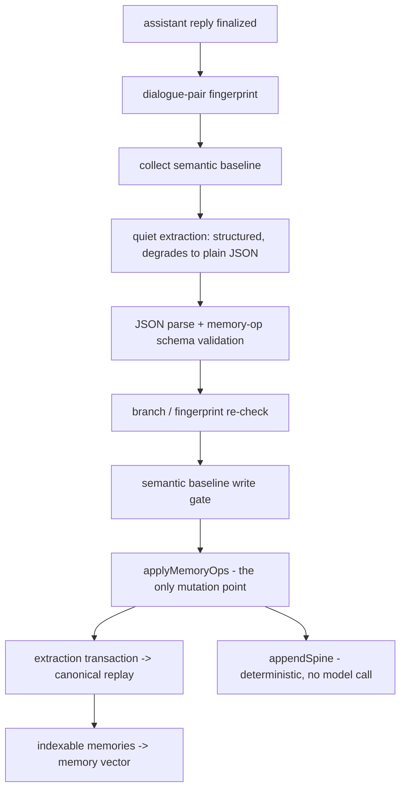
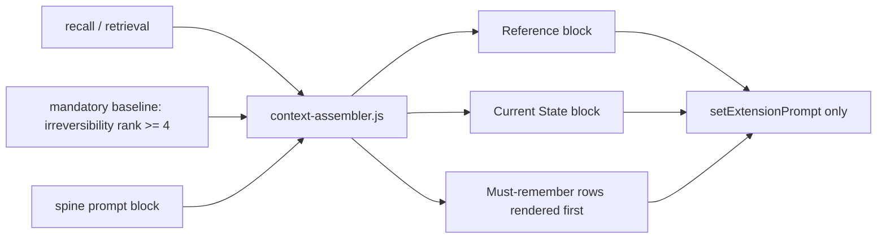

# Architecture

<!-- Versioned & append-only: never edit past versions; newest is last. -->


<!-- VERSION 1 -->
## v1 - baseline (pre-versioning)

> System architecture, module boundaries, key flows, diagrams.


<!-- VERSION 2 -->
## v2 - 2026-09-11 00:22:36 - describe the v5.5 architecture and module boundaries

### 1. Four kinds of data

The design keeps four things apart that summaries usually merge:

    A. Canonical Baseline       Persona / Character / World Info       "what it always was"
    B. Extraction Transactions  one per completed user+assistant pair  "what this turn changed"
    C. Canonical Memory Store   replay(transactions)                   "what the story changed"
    D. Derived Indices          vector / summaries / spine / audits    "how to find it again"

Canonical never depends on Derived. Losing the derived record costs a rebuild, never a fact.

One nuance introduced in iteration 13: the **memory spine** is logically authoritative (it is appended
from the same operations that mutate the store, never by a language model, so a replay rebuilds it
byte-identically) but it is *stored* in the derived record, because it is rebuildable and the chat
file should not carry it.

### 2. Entry chain

    manifest.json
      -> index-v55-bootstrap.js     installs the ownership guard first, then the staged core
           -> v55-store-integrity.js
           -> index-v55.js (init)
                -> index.js          the v5.4-lineage runtime: extraction, replay, retrieval, injection
           -> v55-derived-store.js, v55-summary-runtime.js, v55-floor-fold.js, UI modules

The bootstrap exists because ordering is load-bearing: the store ownership guard must be installed
before the core runs, or canonical replay assignments erase independently-owned runtime state.

### 3. Module map

| Group | Files | Responsibility |
| --- | --- | --- |
| Entry | `manifest.json`, `index-v55-bootstrap.js`, `index-v55.js`, `index.js` | load order, settings UI, generation interceptor |
| Core memory | `memory-core.js`, `memory-extractor.js`, `memory-op.schema.json` | extraction contract, `applyMemoryOps` (the only place memories mutate), replay |
| Injection | `context-assembler.js` | budget, labelling, reference/current-state/mandatory blocks |
| v5.5 runtime | `v55-runtime.js`, `v55-finalizer.js`, `v55-summary-runtime.js`, `v55-floor-fold.js` | finalisation, hierarchical summaries, floor folding |
| v5.5 state | `v55-derived-store.js`, `v55-store-integrity.js`, `v55-spine.js`, `v55-consistency.js` | derived ownership, replay guard, deterministic spine, self-check |
| v5.5 support | `v55-tokenizer.js`, `v55-evidence.js`, `v55-provenance.js`, `v55-privacy.js`, `v55-metrics.js`, `v55-selfcheck.js`, `v55-rerank.js` | accounting, evidence expansion, provenance, privacy, metrics |
| Vectors | `v55-vector-policy.js`, `v55-private-vector-transport.js`, `v55-tauri-native-http-bridge.js`, `v55-tauri-vector-backend.js` | per-chat vector space identity, transport isolation, host-native HTTP |
| Settings | `setting-schema.js`, `setting-store.js`, `setting-importer.js`, `setting-index.js`, `setting-retriever.js`, `source-adapters/` | plugin-owned world info plane |
| Baseline | `baseline-host.js`, `baseline-index.js`, `embedding-profile.js`, `retrieval-eval.js` | semantic baseline collection, indexing, profile identity |
| UI | `settings.html`, `style.css`, `v55-ui-polish.js`, `v55-embedding-profile-ui.js`, `v55-api-connections.js` | panel and connection settings |

### 4. Write pipeline



### 5. Injection path



Injection never appends pseudo-messages to the chat array; it goes through the host prompt extension
API, so the visible transcript and the model context stay independent.

### 6. Failure isolation

- A failed extraction is recorded as a diagnostic and never stored as a memory or a summary.
- The extraction provider degrades once: if the host rejects `response_format`/`json_schema`, the
  remaining attempts for that session use plain JSON instead of retrying a doomed request.
- An unreachable derived backend leaves the derived keys in the chat file, which is the previous
  behaviour - it never silently writes an empty store over a real one.


<!-- VERSION 3 -->
## v3 - 2026-09-11 21:12:14 - state the whole architecture on one page in plain language instead of an iteration-by-iteration log

**Why this version exists.** v1 and v2 grew by appending one section per
development iteration, so a reader had to reconstruct the architecture out of a
change log. This version states the whole system on one page and maps the
project owner's original design keywords onto what the code actually does.
Everything below is written for a reader who does not know the module names.

### 1. The whole system, one picture

```text
                     +-- one extraction pass (one background model call) --+
                     |                                                      |
    raw chat --------+                                                      |
    (+ cold storage) |                                                      |
                     +--> memories (facts)                                   |
                     |        |  tags are glued into the embedded text      |
                     |        v                                            |
                     |   vector space  ---> recall ---> prompt             |
                     |                                                     |
                     +--> per-turn summary --> level-1 digest              |
                              |                                            |
                              +-- NEVER embedded, prompt only -------------+

    independent of all of the above:
    world info / persona / preset library --> baseline index --> prompt
```

Two arrows leave the raw chat, and they never meet. There is no
`summary -> tags -> memory` path in the code.

### 2. Four nouns

| Noun | Plain meaning | Where it lives |
|---|---|---|
| raw chat | the actual dialogue | host chat file, plus a cold copy |
| memory | a fact the system decided to keep: who, what, where, what changed | canonical store (chat metadata) |
| summary | one line per turn describing what happened | derived store; level 1 only |
| recall | choosing a few memories to put back into the prompt | computed per generation, never stored |

### 3. Life of one message

1. The host asks the plugin to build the prompt.
2. The plugin takes the most recent user+assistant pair and asks a background
   model for three things in one call: what happened this turn, what is true
   now, and a list of add/update/replace/close operations on memory.
3. Those operations pass a constitution first: no duplicates, no contradiction
   with what survives, and irreversible facts are never dropped.
4. Accepted operations are written to the canonical store; each memory also
   becomes one vector, with its tags prefixed into the embedded text.
5. For the next generation the current situation is turned into several
   different queries, each runs against the vector space, and the results are
   fused with keyword and timeline matches, then re-scored and cut to a few.
6. The chosen memories, a reference block and the current state are injected as
   text blocks. The per-turn summary is injected too, but it is never searched:
   it cannot be recalled.

### 4. What the source files do

43 source files, about 14.5k lines, all in the repository root.

| Job | Files | Plain description |
|---|---|---|
| Load into SillyTavern, draw the panel | 10 | makes the plugin run and the UI clickable |
| Read chat, extract memories, enforce the constitution | 13 | steps 2-3 above |
| Store memories and summaries | 5 | step 4 above |
| Recall and assemble the prompt | 5 | steps 5-6 above |
| World-info / preset library | 7 | the independent baseline line |
| Measure itself | 4 | metrics and self-check |

### 5. The original design keywords, mapped

| Keyword | What the code does today | Status |
|---|---|---|
| structure | each memory carries slot, kind, entities, topics, scope and importance, so free text is not the only carrier | present |
| vector network | one embedding per memory, but no persisted edges between memories; the graph is rebuilt from shared rare tags for the duration of a single query | half |
| hierarchy | summary levels 1/2/3 are defined, but only level 1 ever materialises | half |
| pathway activation | spreading activation over shared rare entities/topics, 5 iterations, damping 0.18, supersede pairs weighted 1.5; never persisted | present, ephemeral |
| quality compression | irreversible facts are ranked and protected; reversible detail may be evicted | present |
| reusable compression of similar events | a repetition score (0.6 text reuse + 0.4 slot novelty, dead zone below 0.2) merges similar turns into one line while keeping every source id | built, never fired |
| basic relations | who-knows-what is emitted 0.0% of the time; entities and topics are extracted, relations are not modelled | weak |
| generativity | eviction is driven by reconstructability: forget what can be regenerated, keep what cannot | present |
| preset library | setting modules and a baseline index over world info and persona | present, inert |
| modules and bridges | four installers wrap one host interceptor; canonical and derived stores with a documented fallback | present |
| tree structure | the summary tree is depth 1 in practice; memories have slots, not parents | half |

### 6. What is deliberately not there

- Summaries are not embedded, so they cannot be retrieved; they are injected.
- There is no independent tag-lookup channel. Tags only prefix the embedded
  text, add score on an exact entity match, and feed the graph.
- Memory has no parent/child tree.

Current gaps and their measurements are in `07_functional_check.md`; artifacts
that survive from earlier designs are in `09_legacy_inventory.md`.
