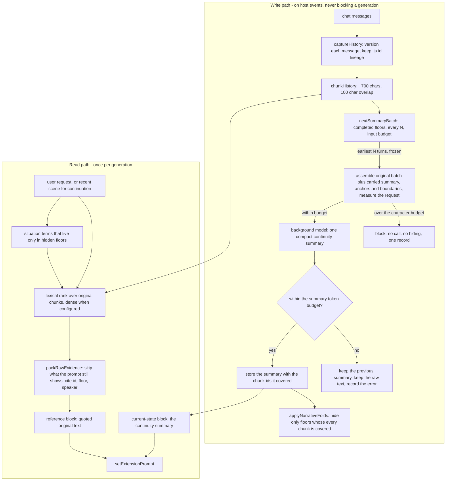

# Architecture

**Scope of this document.** The whole system on one page, for a reader who does not know the module
names. Superseded designs and their measurements are in Git history; the decision that
replaced them is [decisions/ADR-0001](decisions/ADR-0001-narrative-memory-architecture.md).

### 1. The shape of it

Two products serve the [product contract](00_project.md#product-contract).
Original history is authoritative; the following table describes the current implementation,
including the soft-target budget policy of ADR-0032:

| Product | Job | Budget | Rebuilt from |
| --- | --- | --- | --- |
| Narrative summary | Let the story continue: where we are, why, who wants what, what is unresolved | narrative_summary_tokens (soft target, default 600) and narrative_summary_ceiling_tokens (emergency ceiling, 0 derives it); the total injection budget is accounted separately (ADR-0032) | previous summary, active anchors and knowledge boundaries, plus the next N completed turns' original messages |
| Original-text evidence | Answer a question that needs the exact wording, number or negation | narrative_evidence_tokens (default 1000) | indexed original-text chunks, per generation |

The original text is never thrown away to save space. It is chunked, indexed and quoted.
The summary does not reread all earlier originals each pass. Saved state, selected state,
actual prompt injection and correct model use are separate boundaries; source-version validity
and complete recorded coverage do not prove semantic completeness. Active anchors that do not
fit their budget remain stored but are parked, without a guarantee that retrieval will recover
them for a continuation. Parking is a budget outcome, not a loss: the build resolves every live statement to a
carrier - its own injected line, a quoted original row, or nothing - and reports the ones in neither (N25).

**The shipped retrieval path**, once, because those layers are not equally load-bearing and one of them is
an offline experiment that lives in the same module as the shipped packer:

| Layer | Ships? | Rule or weight | Decision |
| --- | --- | --- | --- |
| Query planning | yes | focused for a request, legacy for a continuation; parked anchors are appended | retrieval-query.js |
| Lexical | yes | BM25, weight 1 | baseline-index.js |
| Dense | yes, when configured | weight 0.1 (sweep: 0 → 63%, 0.1 → 65%, 0.2 → 62%, 0.35 → 58%, 1.0 → 58%) | ADR-0015 |
| Situation terms | yes | weight 0.5, at most 8 rare terms of the current scene | ADR-0019, ADR-0022 |
| Character description | yes | weight 0.6, at most 4 named characters in the scene | ADR-0020 |
| Fusion | yes | reciprocal rank fusion, k = 60, one vote per channel | ADR-0015 |
| Cross-encoder rerank | optional; off in the acceptance install | reorders the shortlist only, and is the only extra model round-trip per turn | ADR-0016 |
| Packer | one of two | `greedy` ships (rank order, one span per message, no repeated text, under the token budget); `submodular`/`relevance` is a ruler-only experiment | ADR-0014, ADR-0022 |

`shippedRetrievalConfig()` builds that list from the constants the ranker and the packer default to, and every
build reports it as `retrieval_config`, so "which layers ran, and how strong was each" is answerable from a
trace rather than by reading the module. Listing the channels without their weights cannot tell a weak channel
from a decisive one: "dense was on" reads the same at 0.1 and at 1.0.

### 2. Life of one generation

1. The host calls the single interceptor (aetheriaUnifiedMemoryV54Interceptor).
2. If the host is generating a quiet prompt, an impersonation, or the plugin's own background
   summary, both prompt channels are cleared and the call returns.
3. Otherwise the plugin captures the chat into the versioned archive, folds what the accepted
   summary covers, and builds:
   - the current-state block: the continuity summary, or nothing when there is none;
   - the reference block: original-text evidence, plus relevant setting entries.
4. The two blocks are registered with setExtensionPrompt at fixed depths, and the transcript's
   collapsed styling is re-applied.
5. After the generation, the host's events schedule the background pass: at most one summary job per
   chat store at a time, using exactly the earliest N unsummarized completed turns. The request is frozen
   before dispatch, assembled from the original messages of those turns plus the previous summary,
   active anchors and knowledge boundaries, and the string that is measured
   is the string that is sent. A backlog does not enlarge the batch and a character budget does not split
   it: a batch the budget cannot hold is a block, not a call (ADR-0024).

Retrieval uses indexed original-text chunks, not summaries. The default focused query uses a pending
user request; scene names are collected independently for the profile channel and may resolve pronouns.
Pure continuation and generation without a new user row retain the last-three-message query (preceding
rows capped at 80 characters, combined query capped at 5000). Pure user continuation commands remain
archived but cannot become evidence. The experimental adaptive continuation query is not enabled by default.

Knowledge-boundary migration normalizes explicit syntax and exact duplicates, using confirmation time
to apply the existing subject-replacement rule. Different same-pass assertions survive and remain flagged;
the host does not infer which assertion is true. Diagnostic coverage inspects actual quoted spans.
User-target coverage is a proxy; query-derived entity coverage is only a trace. Rerank cost reports
elapsed time, estimated input tokens and provider tokens when available, including failed attempts.

### 3. Where the decision to show or hide text lives

| Question | Answer | Module |
| --- | --- | --- |
| Which text is covered by the summary? | The exact chunk-id prefix the summary reported | raw-history.js, validSummary |
| May this floor leave the prompt? | Only if its entire complete turn is covered by a committed batch; exclude the greeting | raw-history.js, applyNarrativeFolds |
| What if the summary cannot be injected? | Every floor it covered comes back, and the reason is recorded | narrative-runtime.js, buildNarrativeContext |
| What if the history changed under the summary? | The summary is dropped, the invalidation is reported, and the floors come back | narrative-runtime.js, prepare |
| How current is the injected state block? | It is the projection of the last accepted summary, and it says so in floors: "current as of floor N; anything later in the transcript wins". The panel reports the committed coverage and the injected coverage separately, and compares their content versions rather than their floor counts (ADR-0024, ADR-0025) | narrative-runtime.js, raw-history.js |
| Who writes the transcript styling? | Only the projection of the markers; it never writes chat state | v55-floor-fold.js |

### 4. Modules

Live path, reachable from index-v55-bootstrap.js:

| Job | Files |
| --- | --- |
| Host bootstrap and settings shell | index-v55-bootstrap.js, index-v55.js, settings.html, style.css, v55-ui-polish.js, v55-api-connections.js, v55-embedding-profile-ui.js |
| Original text: archive, chunks, folds, evidence | raw-history.js, v55-floor-fold.js |
| The pipeline: summary job, index sync, budgeted assembly | narrative-runtime.js |
| Request/continuation query planning, independent scene names | retrieval-query.js |
| The quiet summary request (cloned preset, response metrics) | summary-transport.js |
| Host adapters (store, identity, vectors, setting retrieval, metrics) | index.js |
| Chat store, replay, operations, tokenizer | memory-core.js, v55-store-integrity.js, v55-store-compact.js, v55-derived-store.js, v55-tokenizer.js |
| Vector transport and space identity | v55-vector-policy.js, v55-private-vector-transport.js, v55-tauri-vector-backend.js, v55-tauri-native-http-bridge.js, v55-rerank.js |
| Setting plane | setting-schema.js, setting-store.js, setting-importer.js, setting-index.js, setting-retriever.js, source-adapters/ |
| Baseline plane | baseline-index.js (the tokenizer and lexical floor the ranking uses) |
| Measurement | v55-metrics.js, answer-adjudication.mjs, recall-baseline.mjs, recall-embed.mjs, embedding-cassette.mjs, natural-track.mjs, detail-survival.mjs, acceptance-longchat.mjs |

Retired (ADR-0007, ADR-0009): the v5.4 extraction pipeline, the prompt assembler, the recall path,
the cold-snapshot cache, the length certificate, the quality metrics, the reranker, the retrieval
self-check and the baseline builder - with the tests that pinned them. index.js keeps the host
adapters, the chat store, the setting plane and the migration of old chats.

The old fact set itself no longer lives in the chat file either: memories, slots and hierarchical_summaries
are derived keys, written to the external record and rebuildable from the canonical replay log, which
the chat file keeps (ADR-0004).

### 5. Invariants

| Id | Statement | Enforced by |
| --- | --- | --- |
| N1 | A floor is hidden only while an accepted summary covers every chunk of it | applyNarrativeFolds |
| N2 | Each accepted batch hides exactly N complete turns, including its last turn; batch-external text and the greeting remain visible (ADR-0023) | nextSummaryBatch, applyNarrativeFolds |
| N3 | A summary is injected only while it still matches the current chunk list | validSummary, prepare |
| N4 | If the summary cannot be injected, its floors are restored in the same call | buildNarrativeContext |
| N5 | Background work is written only into the chat that started it | services.isCurrent |
| N6 | Superseded message versions are archived, never overwritten | captureHistory |
| N7 | Evidence quoting skips text the prompt still carries, and never quotes the same text twice | packRawEvidence |
| N8 | Anchors and boundaries are injected only with the summary they were derived from, and are never recomputed between passes | prepare, source_revision |
| N9 | The summary request is assembled from original messages, one entry per source, and the text that is measured is the text that is sent (ADR-0024) | nextSummaryBatch, summaryMessages, summaryRequest |
| N10 | A local input-budget block calls no model, hides no floor, and is one record per frozen batch and budget; a character budget is never reported as proof the context window fits (ADR-0024) | updateNarrative, summaryBlockState |
| N11 | A failed summary records its stage - every stage of `FAILURE_STAGES`: transport, empty_body, truncated, over_budget, format, input_budget, anchor_ops - with the input cost and response status, and a later success marks it recovered instead of erasing it (ADR-0025) | tagged, summary_last_error |
| N12 | A committed state has a source version and a content version; the prompt is called injected only after the host has been given it, and assembly re-composes if the state commits while it waits (ADR-0025) | stateRevisionOf, runNarrativeGeneration, composeContinuity |
| N13 | The unsummarized tail is a state (idle, accumulating, summarizing, failing, blocked, backlog) and only a block, a real run of failures, or a stalled oversized backlog warns (ADR-0025) | summarizeState, warningsFor |
| N14 | An anchor changes only by a named operation on a host-assigned alias: `更新 A3`, `新增`, `结束 A5`. A retired value is never injected, and it moves to a bounded ledger instead of being deleted (ADR-0028) | mergeAnchors, planAnchors, parseAnchorChanges |
| N15 | The anchor block is filled evenly across kinds, newest-first inside each kind, and what it parks is reported (ADR-0026) | orderAnchors, selectAnchors |
| N16 | A label is a display name, not an identity: it is Unicode-normalised and whitespace-collapsed, and no rank table decides which kind is served first; recency does (ADR-0027, ADR-0028) | anchorSubjectKey, orderAnchors |
| N17 | Every anchor reference is checked before anything is written - the alias is in the frozen request, every source token is in this batch's text, the record is not changed twice and still carries the frozen revision - and a refused batch commits nothing, hides nothing and never falls back to a label match (ADR-0028, ADR-0029) | parseAnchorChanges, mergeAnchors, sourceBatchFingerprint |
| N18 | Every nonempty anchor line is validated, including inline and unbulleted operations. Missing/empty sections refuse coverage; explicit `无` is distinct; an unmistakable operation without its heading is recovered as `inferred`. Statements are stored whole; label style cannot authorize replacement or refusal (ADR-0028, ADR-0029) | parseAnchors, parseAnchorChanges, updateNarrative |
| N19 | A source cell may name several original rows; every token is validated against the batch and every token is kept (ADR-0029) | parseAnchorChanges, mergeAnchors |
| N20 | A batch refused for its anchor section keeps the operations, summary and boundaries the first answer already validated; one targeted repair supplies only replacements for the rejected lines, and kept plus replacement lines are re-parsed as one batch. The repair is budget-checked before it is sent, costed apart, and both paths share one final current-state check (ADR-0029) | anchorRepairRequest, evaluateAnswer, commitMerged, stillFrozen |
| N21 | A live acceptance run starts only after the repo, the deployed disk and the loaded module agree; the loaded module is hashed, never inferred from the served file (ADR-0029) | runtime-precheck.mjs |
| N22 | `anchors_same_subject` is a same-label record count, not a contradiction detector, and no label authorizes a replacement (ADR-0027, ADR-0029) | countAnchorCollisions, warningsFor |
| N23 | The runtime names the packer policy it ships instead of inheriting a default, and every build reports the retrieval configuration built from the same constants the ranker and the packer use, so the experiment cannot be mistaken for the shipped path (ADR-0015, ADR-0016) | SHIPPED_PACK_POLICY, shippedRetrievalConfig |
| N24 | The knowledge-boundary block reports what it injected and what the budget left out, the way the anchor block does; an accepted entry that does not fit is named instead of silently omitted | selectKnowledge, warningsFor, readNarrativeReport |
| N25 | Every live ledger statement is resolved each build to one of two measured carriers - its own injected line, or a quoted original row - and the residue is reported and warned with the statement named. It is a structural lower bound and says so: the summary prose is not read, knowledge boundaries have no source rows of their own, and records are compared by id rather than by meaning, so an anchor an injected knowledge line restates still counts as uncarried | ledgerCarriers, warningsFor, readNarrativeReport |
| N26 | Both error directions of the ledger are reported each build: a live statement with no carrier (`required_none`, N25), and a quoted row that only a retired statement names (`superseded_evidence`). The second is a risk indicator, not a verdict - the evidence header says historical states need not be current, so only the reply can say whether the old value was used as the current one. A row shared by the retired and the current statement does not count | supersededSources, readNarrativeReport |
| N27 | A graded answer is a record, not a verdict: a row carries the machine verdict, whether the assembled prompt carried the fact, whether the reply conveys it and whether the probe is defective, and the classification and the memory credit are derived from those. A pass requires sufficient prompt evidence, so a correct answer on an empty prompt is a recorded `prompt-insufficient` row and not a success, and both directions of grader error have a name | answer-adjudication.mjs |
| N28 | A dense measurement replays a recorded transport cassette, keyed by the request that produced each vector - model, base, role, the provider task the plugin derives from them, and the exact input text - so a changed input is a miss and never a silent replay. A run that cannot replay a vector refuses to print a table and exits non-zero instead of reporting a lexical result under a dense header, and a paired comparison refuses two runs whose recorded vectors differ (ADR-0010) | embedding-cassette.mjs, recall-baseline.mjs, recall-embed.mjs |
| N29 | A detail-survival probe attributes a needle to the channel the probe turn actually saw, read from `injections.thisTurn` and never the previous turn's block, and selects what to ask from the committed summary rather than from the author's expectation; a question that contains the needle it tests is refused before a generation is spent, and a needle match is a machine reading that answer-adjudication.mjs classifies. The mode measures only and changes no summary, retrieval or injection behaviour | detail-survival.mjs, acceptance-longchat.mjs, test-detail-survival.mjs |
| N30 | A retrieval number is read with the track that produced it: the synthetic probe (query cut from the answer), the source-first labelled set (authored question, source literal) or natural capture (the real user message through planRetrievalQuery). Only natural capture is product evidence, no track feeds a summary to an earlier turn, and a natural run declares its real queries and prefix chunks as cassette inputs (ADR-0033) | natural-track.mjs, recall-baseline.mjs, retrieval-audit.mjs, test-natural-track.mjs |
| N31 | A harness that changes chat state rebuilds the host's bounded ChatSurface through the host's own entry points - reset the surface epoch, redisplay the canonical chat, then re-apply fold styling - because the surface is one contiguous viewport plus the true tail and refuses a stale mounted set rather than sorting it. A partial host, a mismatched module URL and a second host instance are refused, and a restore does not save unless asked (ADR-0034) | acceptance-capture.js, acceptance-longchat.mjs, test-acceptance-capture.mjs |
| N32 | A detail-survival needle is matched with a verbatim reading first and a paraphrase-tolerant content-run reading second, and the matched token is recorded; retention, channel attribution and the reply reading share the matcher, while the question-leak check stays strict. The reading is a measured heuristic, so the negative control remains mandatory and answer-adjudication.mjs still classifies the row (ADR-0035) | detail-survival.mjs, test-detail-survival.mjs |
| N33 | The summary request carries a still-live state or condition through the merge even when the batch does not change it and nobody mentions it, and deletes a detail only when it is both resolved and no longer affecting later action (ADR-0036) | raw-history.js, test-summary-contract.mjs |
| N34 | A trimmed evidence quote keeps the part of the message the question is about: the window covering the most of the question's own **words** wins, with the ranker's n-grams compared second and the head-anchored window as the incumbent; only strictly more coverage moves it, and the length, budget and slot count are unchanged (ADR-0037, ADR-0041) | fitEvidenceSpan, slideWindowToQuery, packRawEvidence, test-evidence-window.mjs |
| N35 | A run that plays a turns file freezes the input it used into `<out>/turns.fixture.json` before the first model call, in the schema the loader already accepts, with the source path, byte count and sha256 as identity, so the run can be re-run as the same fixture after the source file is gone (ADR-0038) | freezeTurnsFixture, acceptance-longchat.mjs, test-detail-survival.mjs |
| N36 | A build records the ranking it was given (`evidence_candidates`: order, span, fused and per-channel scores) and one outcome per candidate (`evidence_trace`: included / budget / too_long / entry_cap / not_selected / same-text / same-message, plus whether an included quote was shortened), both pure, bounded to 40 rows with complete counts, so a row that carried the answer can be told apart from a row that never ranked without a live debugging session (ADR-0039) | summarizeEvidenceCandidates, summarizeEvidenceTrace, narrative-runtime.js, test-narrative-pipeline.mjs |
| N37 | A detail-survival probe says what its answers are evidence of: `single` asks every item in one turn (one sample of a contended evidence budget) while `perTurn` asks one per turn and restores the phase-1 state before each later question, so N questions are N independent samples; the record carries the mode, an independence reading and each probe's restored flag (ADR-0040) | probeIndependence, buildDetailEvidence, acceptance-longchat.mjs, test-detail-survival.mjs |
| N38 | A packaging rule that depends on the query is proved through `buildNarrativeContext`, not only through a harness: the window rule was measured by two harnesses that passed `query` while the runtime did not, so it was inert in every shipped prompt until the runtime passed it (ADR-0037 correction) | packRawEvidence, narrative-runtime.js, test-narrative-pipeline.mjs |
| N39 | The evidence window is moved by the question's **words** first and its n-grams second: n-grams match prose that shares two characters, so a head window can cover fragments of the question and no word of it, which is how a quoted answer stayed outside its own quote (ADR-0041) | queryWindowTerms, segmentWords, slideWindowToQuery, test-evidence-window.mjs |
| N40 | A summary body refused for `format` or `over_budget` earns one repair - the request again, a correction, and the refused text to cut - recorded as `body_repair` with its own cost and re-evaluated against the same checks, while the request states the hard ceiling and its consequence; `input_budget` stays an unrepaired local block (ADR-0042) | summaryBodyRepairRequest, summaryRequest, commitMerged, test-anchor-repair.mjs |

| N41 | The character-description channel scores the **densest descriptor cluster** in a chunk (the name only has to appear somewhere in it), not the count of descriptor words near a mention: a long action row where the character acts used to beat the row that introduces her, and the reading that says "she was described" now needs a cluster rather than one word near the name (ADR-0044) | describingWindow, profileTargets, profileRecall, PROFILE_TERMS, test-narrative-pipeline.mjs |

### 6. What this architecture does not do yet

- Dense retrieval over original text needs a configured embedding backend; without one the pipeline
  is lexical-only and says so in its diagnostics. The offline ruler never fetches: it replays a cassette,
  and a vector the cassette cannot supply makes the run invalid rather than making it lexical (N28). No
  cassette is committed, so a dense number from an earlier run is reproducible only from the recording
  that produced it - and this project's earlier dense numbers have no recording.
- Recall is trigger-driven, not question-driven: the query is the recent messages, so the thing to measure is
  whether the earlier floors of a returning person, place or object come back with it. That happened in 3 of 6
  such moments, and 5 of 6 after the situation channel of ADR-0019; the channel's own metric counts character
  n-grams rather than names and is an indicator, not a score. dev_docs/04_roadmap.md records the runs.
- The archive keeps every superseded version, and nothing prunes it. Measured at about one copy of the
  conversation text (41-351 KB per chat, 4-33% of the file), which is why it stays lossless (ADR-0004).
  Growth on very long chats is still unmeasured.
- Whether the three unexplained single summary failures in the two live runs were caused by the 600-token
  summary budget is still open. The failures are now classified and kept, so the next occurrence is
  answerable; the live summaries landed at 532 of 600 tokens, which is suggestive and not proof (ADR-0025).
- The model context window is unknown to the plugin. `narrative_input_chars` bounds the request the
  plugin builds; it is reported with `context_tokens_status: 'unknown'` and never as proof the provider
  will accept the call (ADR-0024). Measured when the 18,000 default was set: the ten-turn request was 23,742
  characters with a 556-character instruction block. That block is 1,110 characters now (the stated ceiling
  added by ADR-0042), and a verbose ten-turn batch has since needed 43,658 characters, which is why a new
  install starts at 60,000 (ADR-0043).
- Knowledge boundaries are text, not enforcement: a character cannot be prevented from acting on a
  fact that appears in the summary.
- The injected state block is a snapshot of the last accepted summary (N8). A state change reaches it only
  at the next pass - measured lags of 4 to 9 turns across two runs, and changes made near the end never
  reached a block at all - so every block header names its horizon rather than implying it is current
  (ADR-0018). Folding is what keeps the window safe: it never hides a floor the summary does not cover, so
  the change is still in the prompt (N1, N2).
- Knowledge is one line per character, bundling what that character knows and does not know (ADR-0018). The
  host counts characters that take more than one line and warns instead of merging them, because only the
  summary knows which of two statements is current.
- v55-spine.js survives because the live memory-core.js uses it for the fact model spine bookkeeping,
  and applyMemoryOps is the migration path for old chats. Retiring it is a data decision, not a
  dead-code one (ADR-0009).
