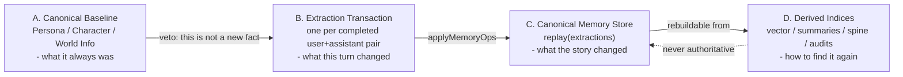
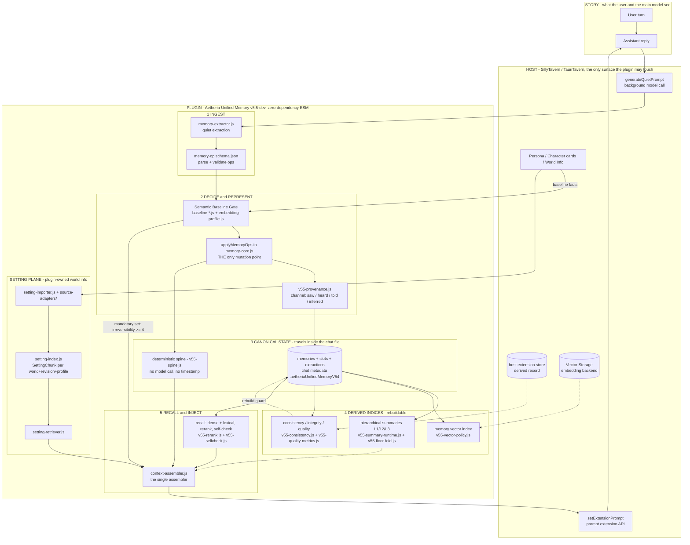

# Concept Map

<!-- Versioned & append-only: never edit past versions; newest is last. -->

<!-- VERSION 1 -->
## v1 - 2026-09-11 20:49:36 - add a single-page concept map of the v5.5 memory system

> The whole project on one page: the concepts, how they relate, and which module owns each.
> Read this before `01_architecture.md` when you want the mental model rather than the file map.

### 1. One sentence

Turn dialogue that already happened into durable, addressable, logically ordered long-term memory,
and put as much of it back into the model's context as the budget allows - without ever losing a fact
that cannot be undone.

    ingest (dialogue) -> decide & represent -> retain & compress -> recall & inject

### 2. The load-bearing idea: four kinds of data

Summaries usually merge these four; this design keeps them apart. Canonical never depends on
Derived, so losing a derived index costs a rebuild, never a fact.

### 3. System concept map

### 4. The two stores

| Store | Medium | Holds | Losing it |
| --- | --- | --- | --- |
| Canonical | chat metadata key `aetheriaUnifiedMemoryV54` | memories, slots, extraction log, fingerprints, baseline/vector payloads, hierarchical summaries, entity registry, binding, runtime identity | loses facts |
| Derived | host extension store, IndexedDB fallback | cold turns, scene summaries, floor folds, summary history, provenance registry, diagnostics, **spine** | costs a rebuild |

The spine is the nuance: logically authoritative (appended from the same ops, never by a model, so a
replay rebuilds it byte-identically) but stored as derived, because it is rebuildable and the chat
file should not carry it.

### 5. What each concept maps to

| Concept | Owner |
| --- | --- |
| Load order is load-bearing | `manifest.json` -> `index-v55-bootstrap.js` (ownership guard first) -> `v55-store-integrity.js` -> `index-v55.js` -> `index.js` |
| The only mutation point | `memory-core.js` `applyMemoryOps`; canonical state is `replay(extractions)` |
| Never re-register the baseline | `baseline-host.js`, `baseline-index.js`, `embedding-profile.js` (gate thresholds live in README) |
| One assembler, no fake messages | `context-assembler.js` + `setExtensionPrompt`; two prompt keys, reference and current state |
| Compression without drift | `v55-floor-fold.js` (fold raw floors behind a coverage certificate), `v55-digest.js`, `v55-summary-runtime.js` |
| Deterministic ordering | `v55-spine.js` |
| Rebuild safety | `v55-derived-store.js`, `v55-store-integrity.js`, `v55-consistency.js` |
| Evidence, not memory | `v55-evidence.js` (archived original text; `memory-core.js` never reads it) |
| Privacy and identity | `v55-privacy.js` (role-private visibility), `entity_registry` |
| Vectors, isolated per space | `v55-vector-policy.js`, `v55-private-vector-transport.js`, `v55-tauri-vector-backend.js`, `v55-tauri-native-http-bridge.js` |
| World info as a document plane | `setting-schema.js`, `setting-store.js`, `setting-importer.js`, `setting-index.js`, `setting-retriever.js` |
| Measured, not asserted | `v55-metrics.js` (cost), `v55-quality-metrics.js` (key_retention, causal_recall, causal_injected, compression) |

### 6. Irreversibility: the ranking that is not a relevance score

A promise, a death, an ownership transfer or a secret learned must not be left to recall.

    commitment 5 | relation 4 | ownership 4 | knowledge 3
    intention 2 | world_delta 2 | state 1 | belief 1 | event 1

`NEVER_DROP_RANK = 4`: at or above this rank a memory is injected whatever recall decides.

### 7. Invariants

| Id | Statement |
| --- | --- |
| I1 | Canonical state is `replay(extractions)`; nothing else may rewrite it |
| I2 | Summaries derive from original turns, never from other summaries |
| I3 | Every memory records how its holder came to know it (`channel`) |
| C1 | A memory that cannot be derived from the chat must not live in the derived record |
| C2 | Deleting the derived record must never delete a fact |

### 8. Deliberate boundaries

- No brain-like rewrite: the design is additive and replayable by construction.
- No model training, no external memory service, no second source of truth for generated text.
- Injection goes through the host prompt API only; the real chat array is never spliced.
- A failed extraction is a diagnostic, never a memory; the extraction provider degrades once
  (structured -> plain JSON) instead of retrying a doomed request.

### Where to go next

- [01_architecture.md](01_architecture.md) - the same system as a module map and file map
- [03_data_model.md](03_data_model.md) - canonical vs derived fields, ownership rules, spine shape
- [06_architecture_drift.md](06_architecture_drift.md) - what was audited out of the core function
- [07_functional_check.md](07_functional_check.md) - what each stage actually measured
- [../README.md](../README.md) - user-facing behaviour, baseline sources and gate thresholds
